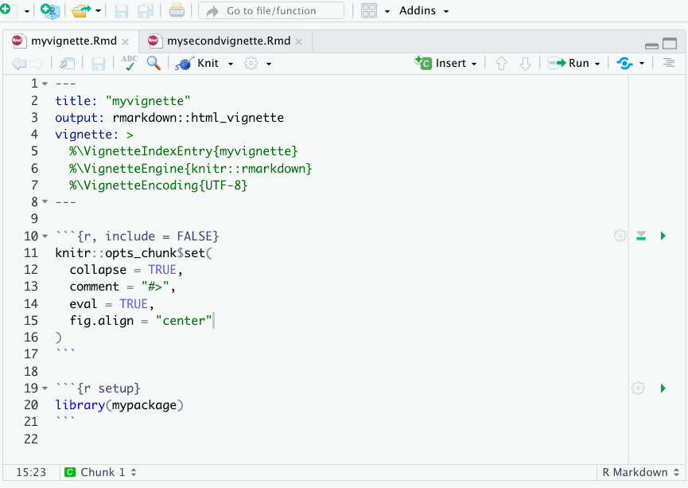

<!-- README.md is generated from README.Rmd. Please edit that file -->

```{r, include = FALSE}
knitr::opts_chunk$set(
  collapse = TRUE,
  comment = "#>",
  fig.path = "man/figures/README-",
  out.width = "100%"
)
```

# donteval

```{r, echo = FALSE}
version <- as.vector(read.dcf('DESCRIPTION')[, 'Version'])
version <- gsub('-', '.', version)
``` 

<!-- badges: start -->
[](https://www.gnu.org/licenses/gpl-3.0.en.html)
[](https://www.tidyverse.org/lifecycle/#experimental)
[](https://github.com/abichat/donteval/commits/master)
[)`-yellowgreen.svg)](/commits/master)
<!-- badges: end -->

**donteval** provides RStudio addins to automatically set the `eval` argument of `knitr::opts_chunk$set()` in vignettes to `TRUE` or `FALSE`.

## Installation

You can install **donteval** from [GitHub](https://github.com/) with:

``` r
# install.packages("remotes")
remotes::install_github("abichat/donteval")
```

## Usage

**donteval** may be particularly useful when you want to `check()` your package without running long vignettes.


